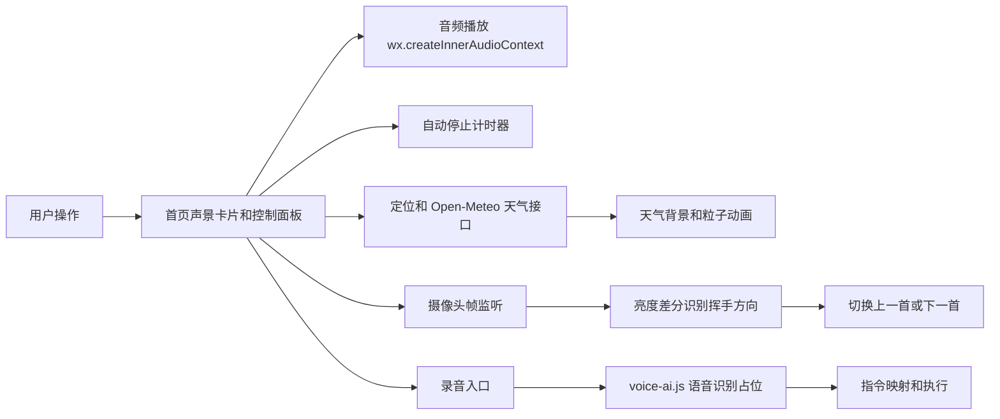

# 月眠助眠微信小程序

这是一个助眠声景类微信小程序原型。项目围绕“睡前放松”场景，完成了音频播放、声景卡片、自动停止、天气联动背景、手势切歌尝试和语音指令入口。

## 项目定位

这个项目不是简单的静态页面，而是一个可以继续扩展成真实助眠工具的产品原型。它适合在简历和面试中展示：

- 微信原生小程序开发能力。
- 音频、定位、摄像头、录音等小程序 API 使用经验。
- 用 AI 工具辅助完成产品原型和交互逻辑的能力。
- 对“已完成能力”和“预留接口”的边界说明能力。

## 已完成功能

### 1. 声景播放

内置 8 类声景：

- 深夜海浪
- 篝火火苗
- 森林晚风
- 窗边夜雨
- 午后风铃
- 月光钢琴
- 柔软云层
- 呼吸练习

播放逻辑使用 `wx.createInnerAudioContext`，支持循环播放、暂停、切歌和声源切换。

### 2. 自动停止

支持：

- 不限时
- 15 分钟
- 30 分钟
- 45 分钟
- 60 分钟

用户开始播放后，小程序会根据设定的时间自动停止音频。

### 3. 天气联动背景

小程序通过定位获取经纬度，再请求 Open-Meteo 天气接口，将天气码映射为：

- 晴
- 多云
- 雨
- 雪
- 雾
- 雷雨

天气状态会影响页面背景、声景氛围和粒子动画。

### 4. 手势切歌尝试

项目使用 `wx.createCameraContext` 和 `onCameraFrame` 读取摄像头帧，基于亮度差分判断横向挥手方向：

- 向左挥手：切到下一首
- 向右挥手：切到上一首

当前逻辑更适合真机调试。模拟器可以预览摄像头，但帧识别稳定性有限。

### 5. 语音指令入口

项目已经搭建录音入口、指令映射和执行逻辑，支持文本指令模拟，例如：

- 下一个
- 上一个
- 雨声
- 暂停
- 播放

真实 AI 语音识别服务尚未接入，接口位置在：

```text
miniprogram/services/voice-ai.js
```

这个文件目前会提示“请先接入 AI 语音服务”，后续可以接入云函数、语音识别 API 或自建后端。

## 技术栈

| 模块 | 技术 |
| --- | --- |
| 小程序框架 | 微信原生小程序 |
| 页面结构 | WXML |
| 页面样式 | WXSS |
| 交互逻辑 | JavaScript |
| 音频播放 | wx.createInnerAudioContext |
| 天气接口 | Open-Meteo |
| 定位能力 | wx.getLocation |
| 手势尝试 | wx.createCameraContext、onCameraFrame |
| 语音入口 | wx.getRecorderManager |
| 云函数 | quickstartFunctions 占位 |

## 项目结构

```text
sleepy-weapp/
  miniprogram/
    app.json
    pages/index/
      index.js      # 核心页面逻辑
      index.wxml    # 页面结构
      index.wxss    # 页面样式与动画
    services/
      voice-ai.js   # AI 语音识别接入占位
    assets/
      audio/        # 声景音频
      images/       # 小屋背景图
  cloudfunctions/
    quickstartFunctions/
      index.js      # 云函数占位
  project.config.json
```

## 运行方式

1. 打开微信开发者工具。
2. 选择“导入项目”。
3. 项目目录选择 `sleepy-weapp`。
4. AppID 可以使用测试号或自己的小程序 AppID。
5. 编译后进入首页，测试播放、切歌、定时、天气背景和控制面板。

## 架构图



## 面试可讲点

1. 为什么语音识别写成服务层占位，而不是直接写死在页面逻辑里。
2. 天气码如何映射到小程序页面状态。
3. 手势切歌为什么要区分模拟器和真机调试。
4. 音频播放、定时器、页面状态之间如何同步。
5. 如果继续做，如何接入云存储、用户收藏、最近播放和睡眠记录。

## 当前不足与下一步

- 语音识别服务还没有真实接入，目前是接口预留。
- 手势识别是轻量级亮度差分方案，适合演示原理，后续可以换成更稳定的手势识别模型或云端识别。
- 目前音频资源放在本地，后续可以迁移到云存储或 CDN。
- 还可以增加收藏、最近播放、睡眠记录、睡前心情等功能。
